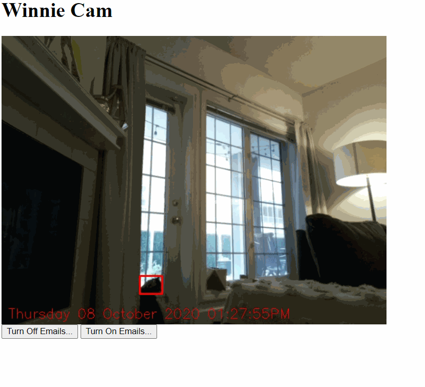
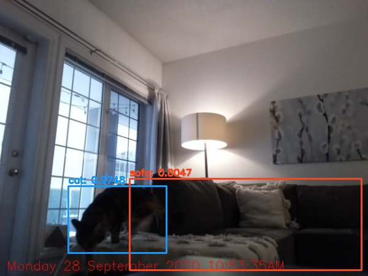

CAT-CAM: Motion Detection and Object Detection for Raspberry Pi 4
=====================

A Flask web streaming video app with motion and object detection emails. 

- Motion capture images are run through Yolo V3 object detection and emailed using a configured Gmail account. 
- Running the full Yolo v3 model takes ~7-10 seconds/image on the stock Raspberry Pi 4 with 4 GB RAM. If consecutive motion is detected this will introduce a lag in motion detection and emails of objects detected. 
- A separate process for running the Yolo object detection was created to prevent issues with Flask app being bogged down. Flask app writes a motion capture image (without bounding boxes) and this gets run through the Yolo process separately.

Object detection and emails can be switched on or off from the Flask app front end. Object detections are logged to a csv as well.

## Setup
[Full walk through of install and configuration here.](https://dbandrews.com/2020/09/28/cat-cam-1/)

Quick Steps:
- get OpenCv 3.4.3.18 with python bindings pip installed (preferably into a virtualenv), gunicorn, nginx if wanting to run externally outside of local Wifi network
- Setup passwordless logins for the Pi - no root login with passwords. SSH only with RSA key - remote development from Visual Studio Code or IDE of choice is recommended.
- Configure nginx for proper forwarding of requests to server 80 -> 443 (https)
- Can build in basic password protection using Nginx and SSL
- Download and install darknet (https://pjreddie.com/darknet/)
- Confirm all settings in `config.py`
  * `web_page_title`: Use this to modify the title text shown on the webpage and browser tab.
  * `fps`: Frames per second the video stream will be limited to. I found that serving the stream over cellular data when out of the local network would introduce a fair bit of      lag and setting this ~ 5 will make it stay in sync.
  * `yolo_path`: Path to the YOLOV3.cfg, YOLOV3.weights files on your Raspberry Pi
  * `email_object_classes`: The class names you want email notifications about when there is a motion capture. Check the file coco.names in the `darknet/cfg` folder for all the options. Emails are only sent when one of these classes is detected (I was getting a fair few emails about chairs being detected before I put this in ;) )
- Setup Supervisord tasks for both gunicorn server, and the Yolo_email script. Example supervisor configuration files included (example_supervisor_conf_*****). Be sure to change paths in these files to reflect your folder structure.
- Setup "credentials.py" in the same format given in example_credentials.py for a **Gmail** acount. Be sure to enable access for less secure apps to this email account (hopefully not your personal account): https://myaccount.google.com/lesssecureapps

Based on code from excellent blogs:  
https://www.pyimagesearch.com/2019/09/02/opencv-stream-video-to-web-browser-html-page/  
http://blog.miguelgrinberg.com/post/flask-video-streaming-revisited  
https://www.pyimagesearch.com/2018/11/12/yolo-object-detection-with-opencv/  

Links for Deploying Publicly Accesible Websites:  
https://blog.miguelgrinberg.com/post/the-flask-mega-tutorial-part-xvii-deployment-on-linux  
https://www.digitalocean.com/community/tutorials/how-to-set-up-password-authentication-with-nginx-on-ubuntu-14-04  

